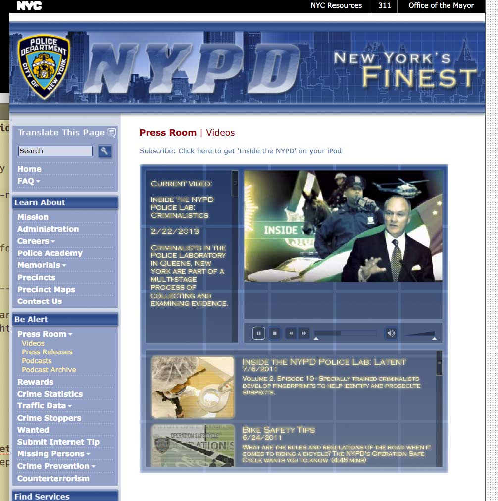

# Snapshot of the NYPD Press Room Videos site

You can view the mirrored version by visiting this URL:

http://wgetsnaps.github.io/nyc.gov--nypd-videos/html/nypd/html/pr/videos.shtml.html

This NYPD public relations video site and its bespoke Flash video player is a true gem of pre-iPhone web development. With __wget__ and __sed__ (and other Bash sloppiness), I was able to copy the source media files and rewire the external Flash player code so that it reads from the mirror file directory, ensuring that this archive of jazz-infused police work videos will not disappear in the next nyc.gov redesign.

It probably wouldn't take too much work to convert all the `.flv` to an open movie format and rewrite the Flash player in JavaScript. But that can be another project. This mirror is meant to be a real-world place to practice web scraping with the Network Panel.

This repository is a mirror of the following site:

|     Key     |                       Value                       |
|-------------|---------------------------------------------------|
| Site title  | Press Room: Videos                                |
| Publisher   | New York Police Department                        |
| URL         | http://www.nyc.gov/html/nypd/html/pr/videos.shtml |
| Mirrored at | 2016-01-11 10:27:20                               |

# Bash script and wget

Here are the Bash commands and __wget__ invocations I used to mirror the site. 

In Step 2, I get the files needed for the Flash player separately, including its `videos.xml` feed, the `flash.js`, and `videoPlayer_2.swf`, which are referred to in the page's JavaScript but not linked to explicitly.

In Step 3, I grep through the `videos.xml` file to get a list of movie files and thumbnails to pass into __wget__.

In the last step, I use __sed__ to change the absolute addresses of the videos and thumbnails in `videos.xml` to local references.

~~~sh
wget --recursive \
     --level 1 \
     --no-host-directories \
     --adjust-extension \
     --convert-links \
     --output-file /dev/stdout \
     http://www.nyc.gov/html/nypd/html/pr/videos.shtml |
     tee -a ./wget.log

# Step 2: get xml file, swf, and js
echo http://www.nyc.gov/html/nypd/html/pr/videos.xml \
    http://www.nyc.gov/html/nypd/includes/scripts/flash.js  \
    http://www.nyc.gov/html/nypd/media/swf/videoPlayer_2.swf |
    tr ' ' "\n" |
    wget --force-directories \
         --no-host-directories \
         --output-file /dev/stdout \
         --input-file - |
         tee -a ./wget.log

# Step 3: get all media files, by grepping the XMLs and piping into wget
cat ./html/nypd/html/pr/videos.xml | 
    grep -oE 'http.*<' | 
    tr -d '<' |
    wget --no-host-directories \
         --force-directories \
         --output-file /dev/stdout \
         --input-file - |
         tee -a ./wget.log

# Step 4: translate the XML URLs to local urls
sed -i '.bak' 's@http://www.nyc.gov/html/nypd/@../../@g' \
    ./html/nypd/html/pr/videos.xml
~~~

## Scrape notes

The original site returns a 404 for [http://www.nyc.gov/html/nypd/images/pr/thumb_medalday.png](http://www.nyc.gov/html/nypd/images/pr/thumb_medalday.png) -- hence, the mirror site will also 404 on this file.
